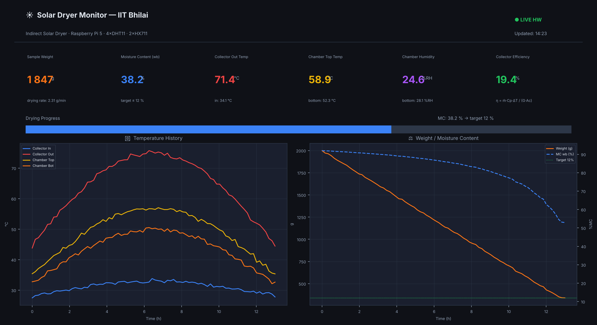
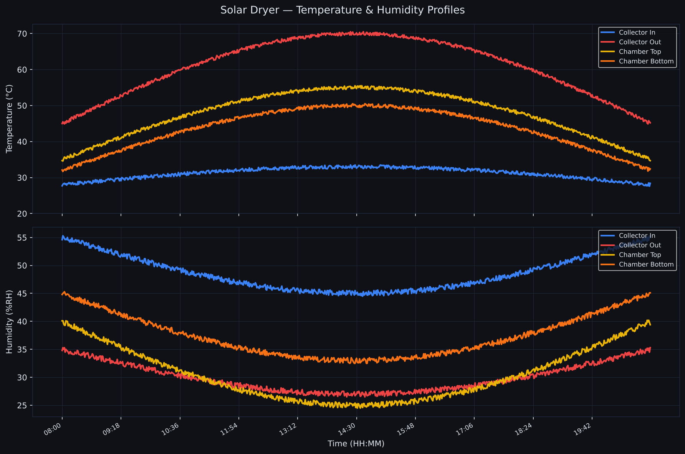
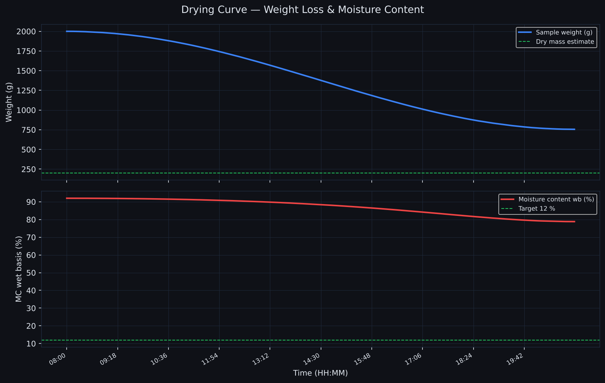
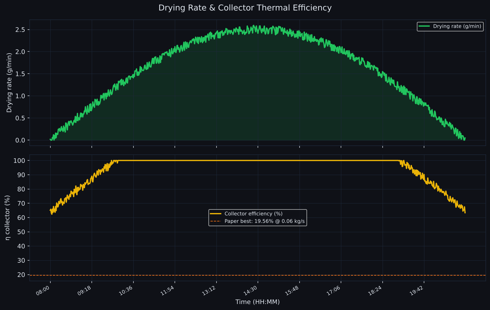

# Indirect Solar Dryer — IoT Monitoring System

**IIT Bhilai — Department of Mechanical Engineering**  
**Ashish Devadas | Project Engineer**

Real-time IoT monitoring system for an Indirect Solar Dryer (ISD) with Phase Change Material (PCM) thermal energy storage. Built on Raspberry Pi 5 with 4× DHT11 temperature/humidity sensors and 2× HX711 load cell amplifiers. Includes a live web dashboard, automated data logging, and post-session analysis plots.

Based on the experimental ISD configuration from:  
> *"Experimental investigation of indirect solar dryer with copper fin-embedded PCM TES"*, Applied Thermal Engineering, 2025

---

## Hardware

| Component | Qty | Purpose |
|-----------|-----|---------|
| Raspberry Pi 5 | 1 | Main controller + web server |
| DHT11 | 4 | Temp + humidity at collector inlet/outlet, chamber top/bottom |
| HX711 + load cell | 2× | Sample weight → drying rate → moisture content |

---

## Features

| Module | What it does |
|--------|-------------|
| `src/sensors.py` | DHT11 and HX711 hardware abstraction; auto-sim mode when no Pi |
| `src/logger.py` | 60-second logging loop → CSV + live JSON state |
| `web_server.py` | Flask dashboard with live charts, tare button, CSV download |
| `scripts/sensor_logger.py` | Standalone logger (no web server) |
| `scripts/calibrate_loadcell.py` | Interactive HX711 calibration |
| `scripts/plot_session.py` | Post-session analysis plots (3 figures) |
| `tests/test_logger.py` | 19 unit tests (physics + sensor sim) |

---

## Quick Start

```bash
git clone https://github.com/a8921/solar-dryer-iot.git
cd solar-dryer-iot
pip install -r requirements.txt

# Test without Pi hardware (simulation mode)
python3 web_server.py --sim
# → Open http://localhost:5000
```

On Raspberry Pi:
```bash
pip install RPi.GPIO adafruit-circuitpython-dht hx711-rpi-py adafruit-blinka

# 1. Calibrate load cells (once)
python3 scripts/calibrate_loadcell.py

# 2. Run dashboard + logger together
python3 web_server.py --port 5000

# Or run logger only (headless)
python3 scripts/sensor_logger.py
```

---

## Dashboard

Open `http://<pi-ip-address>:5000` from any device on the same Wi-Fi.



**Features:**
- Live stat cards: weight, moisture content, temperatures, humidity, collector efficiency
- Drying progress bar (MC: 92% → 12%)
- 4 auto-updating charts: temperature profiles, humidity, weight/MC, drying rate
- CSV download button
- Tare load cells remotely
- History selector: 2h / 4h / 12h / 24h

---

## Measured Quantities

### Moisture Content (wet basis)
```
MC_wb(t) = (W(t) - W_dry) / W(t) × 100 %
W_dry    = W_initial × (1 - MC_initial / 100)
```
Initial: 92% → Target: ≤ 12% (paper's Coimbatore bitter gourd experiment)

### Drying Rate
```
DR(t) = (W(t−1) − W(t)) / Δt    [g/min]
```

### Collector Thermal Efficiency
```
η = ṁ · Cp · (T_out − T_in) / (G · Ac) × 100 %
```
Where ṁ = 0.06 kg/s, Cp = 1006 J/(kg·K), Ac = 2 m², G = incident irradiance (W/m²)

---

## GPIO Pin Assignments (BCM)

| Sensor | Pin | Role |
|--------|-----|------|
| DHT11 #1 | GPIO 4 | Collector inlet temp/humidity |
| DHT11 #2 | GPIO 17 | Collector outlet temp/humidity |
| DHT11 #3 | GPIO 27 | Chamber top temp/humidity |
| DHT11 #4 | GPIO 22 | Chamber bottom temp/humidity |
| HX711 #1 DOUT | GPIO 5 | Load cell 1 data |
| HX711 #1 SCK | GPIO 6 | Load cell 1 clock |
| HX711 #2 DOUT | GPIO 13 | Load cell 2 data |
| HX711 #2 SCK | GPIO 19 | Load cell 2 clock |

See `docs/wiring.md` for full schematic and placement guide.

---

## Generated Plots

Run `python3 scripts/plot_session.py` after an experiment to generate:

### Temperature & Humidity Profiles


### Drying Curve


### Drying Rate & Collector Efficiency


---

## Running Tests

```bash
pytest tests/ -v
```

19 tests covering moisture content physics, collector efficiency formula, and sensor simulation.

---

## Architecture

```
solar-dryer-iot/
├── src/
│   ├── __init__.py
│   ├── sensors.py          # DHT11, HX711, SensorArray
│   └── logger.py           # DryerLogger, MC formula, efficiency formula
├── scripts/
│   ├── sensor_logger.py    # Standalone logging daemon
│   ├── calibrate_loadcell.py
│   └── plot_session.py     # Post-session analysis
├── templates/
│   └── dashboard.html      # Single-page dashboard (Chart.js)
├── tests/
│   └── test_logger.py      # 19 unit tests
├── data/                   # CSV log (gitignored at runtime)
├── media/                  # Generated plots
├── docs/
│   └── wiring.md           # Full wiring schematic
├── web_server.py           # Flask app entry point
└── requirements.txt
```

---

## Dependencies

| Package | Purpose |
|---------|---------|
| `flask` | Web dashboard server |
| `numpy` | Numerical operations |
| `matplotlib` | Post-session analysis plots |
| `RPi.GPIO` | GPIO control (Pi only) |
| `adafruit-circuitpython-dht` | DHT11 driver (Pi only) |
| `hx711-rpi-py` | HX711 ADC driver (Pi only) |

Hardware packages (RPi.GPIO, adafruit-dht, hx711) are only needed on the Raspberry Pi.  
The simulation mode (`--sim`) works on any machine without them.

---

## License

MIT License — free to use and modify with attribution.

---

*Built at IIT Bhilai, Department of Mechanical Engineering, as part of the Indirect Solar Dryer research project.*
